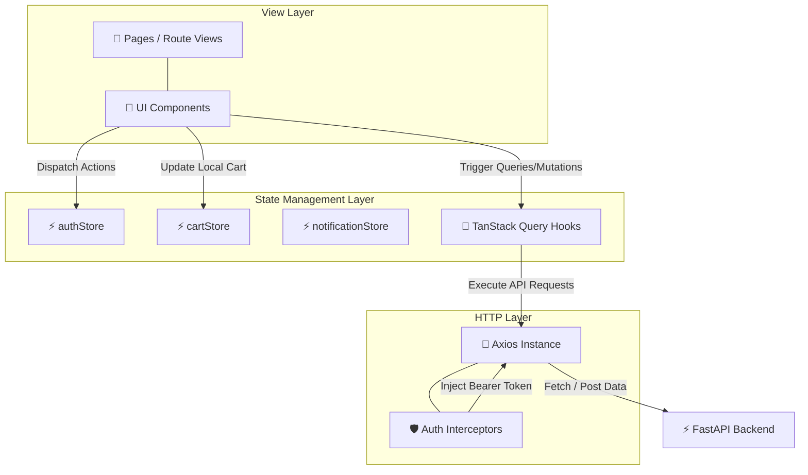

# 🎨 Analytics SaaS Platform — Frontend App

A modern, responsive Single Page Application (SPA) built with React 18, Vite, Tailwind CSS, DaisyUI, Zustand, and TanStack Query. Powers the client dashboard, e-commerce storefront, order management, and real time analytics visualization.

---

## 🛠️ Tech Stack & Shields

### ✨ Features

Feature | Implementation Details | Tech Stack | 
--- | --- | --- |
🔐 Authentication & Security | JWT access/refresh token persistence, automatic header injection, protected routes | Axios Interceptors, authStore (Zustand) |
🛍️ E-Commerce Storefront| Interactive product catalog, cart item management, quantity controls, order checkout | React Query, cartStore (Zustand), DaisyUI |
📈 Analytics Dashboard | Real time aggregate metric charts (daily events, weekly trends, event breakdowns) | Recharts, useAnalytics Hook |
🔔 Live Notifications | Background task execution tracking, notification status updates, badge indicators | React Query, notificationStore (Zustand) |
📊 In App Event Ingestion | Custom tracking hooks for client actions, button clicks, and page view metrics | Custom useAnalytics Hook |

---

## 📐 Frontend Architecture & Data Flow


---
## 📁 Directory Structure

```Plaintext
frontend/
├── .env.example              # Environment variables template
├── index.html                # HTML template entry point
├── package.json              # Project dependencies & npm scripts
├── postcss.config.js         # PostCSS configuration for Tailwind
├── tailwind.config.js        # Tailwind CSS & DaisyUI plugin config
├── vite.config.js            # Vite bundler configuration
└── src/
    ├── App.jsx               # Main router & QueryClientProvider setup
    ├── index.css             # Tailwind directives & base styles
    ├── main.jsx              # React DOM entry point
    ├── api/                  # Modular Axios endpoint services
    │   ├── analytics.js      # Analytics & dashboard API requests
    │   ├── auth.js           # Signup, login, logout, refresh requests
    │   ├── axios.js          # Pre-configured Axios instance with interceptors
    │   ├── events.js         # Event ingestion API requests
    │   ├── notifications.js  # Notifications history API requests
    │   └── orders.js         # Order creation & history API requests
    ├── components/           # Reusable UI component library
    │   ├── CartItem.jsx      # Individual cart item row view
    │   ├── Layout.jsx        # Wrapper with Navbar & Footer sidebar
    │   ├── Navbar.jsx        # Navigation header with auth & cart indicators
    │   ├── NotificationItem.jsx # Single notification status card
    │   ├── OrderCard.jsx     # Order history card view
    │   └── ProductCard.jsx   # Storefront product card with "Add to Cart"
    ├── hooks/                # Custom React Query data-fetching hooks
    │   ├── useAnalytics.js   # Analytics queries & event ingestion mutation
    │   ├── useAuth.js        # Auth state handlers & login/signup mutations
    │   ├── useCart.js        # Cart helpers & price calculations
    │   ├── useNotifications.js # Notification list & status polling query
    │   └── useOrders.js      # Order placement & fetching queries
    ├── pages/                # Main application route views
    │   ├── Cart.jsx          # Shopping cart overview & checkout
    │   ├── Dashboard.jsx     # Real-time analytics dashboard with charts
    │   ├── Login.jsx         # User login & registration form
    │   ├── Notifications.jsx # User notifications feed
    │   ├── Orders.jsx        # User order history
    │   └── Shop.jsx         # Product catalog page
    ├── store/                # Zustand client state stores
    │   ├── authStore.js      # User authentication state & token persistence
    │   ├── cartStore.js      # Shopping cart items & local storage sync
    │   └── notificationStore.js # Unread notification count & active alerts
    └── types/
        └── index.js          # Shared TypeScript type signatures / JSDoc specs

```
---

## 🔑 Environment Variables

Create a ``.env`` file in the ```frontend/``` directory based on ```.env.example```:

Variable| Description | Default |
--- | --- | --- |
VITE_API_BASE_URL | Base URL for the FastAPI backend REST API | ```http://localhost:8000/api/v1``` |


### ⚡ Quick Start

1. Installation

Install all required production and development dependencies:

```Bash
npm install react react-dom react-router-dom zustand axios @tanstack/react-query recharts lucide-react && npm install -D vite @vitejs/plugin-react tailwindcss postcss autoprefixer daisyui@latest @types/react @types/react-dom
```

2. Configuration

Copy the example environment file:

```Bash
cp .env.example .env
```

3. Development Server
Start the local Vite development server with Hot Module Replacement (HMR):

```Bash
npm run dev
```
The app will be available at ```http://localhost:5173```.

---

## 📜 Available Scripts


Command | Action | 
--- | --- |
```npm run dev``` | Starts the Vite development server with HMR |
```npm run build``` | Compiles production-ready static assets into ```dist/``` |
```npm run preview``` | Previews the local production build |
```npm run lint``` | Runs oxLint code quality checks |

### 🧠 State Management Strategy

To ensure clean separation of concerns, the app splits state management into two distinct layers:

1. **Client State (Zustand)**

- ```authStore```: Synchronizes JWT tokens with localStorage, managing global user status across page refreshes.

- ```cartStore```: Persists active shopping cart items, item counts, and totals locally.

- ```notificationStore```: Tracks unread notification badges in real time.

2. **Server State (TanStack / React Query)**

- Manages server side cache invalidation, background refetching, and polling for orders, event streams, and analytics metrics.

- Keeps API communication declarative via dedicated hooks in ```src/hooks/```.